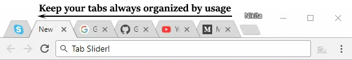

# Tab Slider

 An extension which keeps browser 
tabs sorted in most recently used order, creating totally different browsing experience.

+ [Install for Chrome](https://chrome.google.com/webstore/detail/nobaaibkcalggmjnjhnlmmcldllpogjp/)
+ [Install for Firefox](https://addons.mozilla.org/en-US/firefox/addon/tab-slider/)
+ [Install for Opera](https://addons.opera.com/en/extensions/details/tab-slider/)

How It Works
------------

+ If you stay on tab more than 1 second (default), it will "slide" to the leftmost position;
+ In this way, most recently used tabs always stay left-to-right ordered;
+ Because of the order, naturally, when switching tabs with Ctrl+Tab, the browser will switch to the next most recently used tab;
+ Pinned tabs will slide to the opposite side, from left to right. This behavior is intended, enabling you to conveniently switch between most recently used pinned tabs and most recently used normal tabs with keyboard shortcuts (Ctrl+Shift+Tab switches to most recently used pinned tab, and Ctrl+Tab switches back to most recently used normal tab).
+ You can customize reordering delay and pinned tabs sliding in extension's settings;
+ New active tabs appear left immediately.

*Once you understand this concept, you will find such reordering of tabs absolutely natural and 
logical.* See [this short video](https://youtu.be/X_P4QmVbLdE) for demonstration.

Demo
----




Development
-----------

This extension's codebase is developed to support multiple browser's extension APIs (Firefox, 
Chrome, Opera).

Before going into development, you will need latest [NodeJS](https://nodejs.org) (tested on v6-8)
installed. Then, run:

```bash
npm install
```

After making changes to sources, build the extension:

```bash
npm run build
```

This will bundle extensions for different browsers. They will go to `build` directory ready-to-use.
Note that Opera uses Chromium engine and Chrome extension's version is fully compatible with Opera.

Note: Microsoft Edge does not support moving tabs in its extension API at the time of extension 
creation, so sadly no Edge :(

License
-------

[MIT](license) © [Nikita Savchenko](https://nikita.tk)

Inspired by [this extension](https://chrome.google.com/webstore/detail/tab-stack/gfpdghcockbpiokcaaagmnneioeopnnb).
